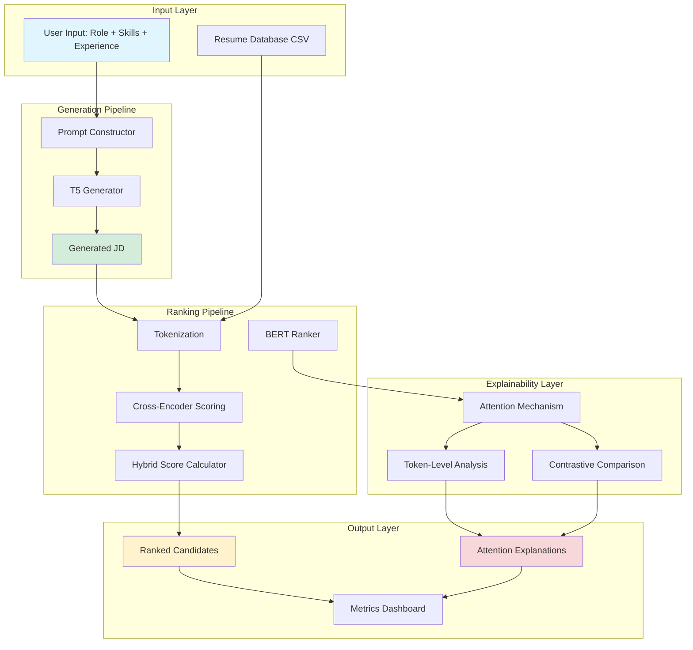

# TalentAI - BERT-T5 Hybrid Framework Architecture

## 📋 Table of Contents
1. [Project Overview](#project-overview)
2. [System Architecture](#system-architecture)
3. [Component Details](#component-details)
4. [Data Flow](#data-flow)
5. [Technical Implementation](#technical-implementation)
6. [Configuration & Scoring Physics](#configuration--scoring-physics)
7. [User Interfaces](#user-interfaces)
8. [File Structure](#file-structure)

---

## 🎯 Project Overview

**TalentAI** is an AI-powered recruitment framework that combines two state-of-the-art transformer models to solve two critical problems in talent acquisition:

1. **Job Description Generation** - Automatically create compelling, constraint-aware job descriptions using T5
2. **Candidate Ranking** - Intelligently match and rank candidates against job descriptions using BERT

### Why This Architecture?

#### The Dual-Model Approach

**T5 (Text-to-Text Transfer Transformer) - The Generator**
- **What it does**: Generates human-like job descriptions from structured inputs
- **Why T5**: Excels at text generation tasks due to its encoder-decoder architecture
- **Key advantage**: Can be fine-tuned on job description datasets to learn industry-specific language patterns

**BERT (Bidirectional Encoder Representations from Transformers) - The Ranker**
- **What it does**: Scores resume-JD pairs for semantic similarity
- **Why BERT**: Superior at understanding contextual relationships between texts
- **Key advantage**: Cross-encoder architecture allows deep interaction between resume and JD tokens

### Core Innovation: Hybrid Scoring

Unlike traditional keyword-matching systems, this framework uses a **multi-dimensional scoring equation**:

```
Score = α × Semantic_Match - β × Skill_Penalty - γ × Experience_Gap
```

This allows recruiters to tune the balance between:
- **Potential vs. Requirements** (adjust α)
- **Strict skill matching vs. Flexibility** (adjust β)
- **Experience level importance** (adjust γ)

---

## 🏗️ System Architecture



---

## 🔧 Component Details

### 1. T5 Job Description Generator (`models/t5_generator.py`)

#### Purpose
Converts structured job requirements into natural, human-readable job descriptions.

#### How It Works

**Step 1: Prompt Construction**
```
Input: role = "Data Scientist", skills = "Python, SQL", experience = 5
Prompt: "generate job description: role: Data Scientist mandatory: Python, SQL experience: 5 years"
```

**Why structured prompts?**
- Ensures consistent generation patterns
- Allows the model to learn specific mappings
- Enables constraint adherence tracking

**Step 2: Text Generation**
- Uses beam search (num_beams=4) to explore multiple generation paths
- Applies no_repeat_ngram_size=2 to prevent repetitive phrases
- Max length of 300 tokens balances detail vs. readability

**Step 3: Fine-tuning (Optional)**
```python
def train(self, dataset, epochs=1, batch_size=4, lr=1e-4)
```
- Trains on job posting datasets to learn industry-specific language
- Uses AdamW optimizer for stable convergence
- Batch processing for memory efficiency

#### Why This Matters
- **Time savings**: Generate JDs in seconds vs. hours of manual writing
- **Consistency**: Maintains company tone and structure
- **Constraint adherence**: Ensures mandatory skills are mentioned

---

### 2. BERT Candidate Ranker (`models/bert_ranker.py`)

#### Purpose
Scores how well a resume matches a job description using deep semantic understanding.

#### Architecture Details

**Cross-Encoder Design**
```
Input: "[CLS] Resume Text [SEP] JD Text [SEP]"
       ↓
    BERT Encoder (12 layers, 768 hidden units)
       ↓
    [CLS] Token Embedding (768-dimensional vector)
       ↓
    Linear Scorer Head (768 → 1)
       ↓
    Sigmoid Activation (0-1 score)
```

**Why Cross-Encoder vs. Siamese?**
- **Cross-Encoder**: Resume and JD interact at every layer → better accuracy
- **Siamese**: Separate encoding → faster but less accurate
- **Trade-off**: We chose accuracy over speed for quality hiring decisions

#### Hybrid Scoring Formula

```python
def get_research_score(self, resume_text, jd_text, mandatory_skills, experience_gap, α, β, γ):
    # 1. Semantic Similarity (BERT-based)
    sim_score = self.predict(resume_text, jd_text)  # 0-1 range
    
    # 2. Skill Coverage Penalty
    missing_skills = count_missing_skills(resume_text, mandatory_skills)
    penalty_missing = missing_skills / total_mandatory_skills
    
    # 3. Experience Gap Penalty
    penalty_exp = min(1.0, experience_gap / 10.0)  # Normalized to 0-1
    
    # Final Score
    return α × sim_score - β × penalty_missing - γ × penalty_exp
```

**Component Breakdown:**

| Component | Range | Meaning | Why It Exists |
|-----------|-------|---------|---------------|
| **α × Semantic Match** | 0-1 | How well the resume meaning aligns with JD requirements | Captures soft skills, cultural fit, transferable experience |
| **β × Skill Penalty** | 0-1 | Fraction of mandatory skills missing | Ensures hard requirements are met (e.g., "Must know Java") |
| **γ × Experience Gap** | 0-1 | Years of experience shortfall (capped at 10) | Balances junior vs. senior role requirements |

**Example Calculation:**
```
Candidate A:
- Semantic Match: 0.85
- Missing Skills: 1/5 = 0.20
- Experience Gap: 2/10 = 0.20

With α=0.7, β=0.2, γ=0.1:
Score = 0.7×0.85 - 0.2×0.20 - 0.1×0.20
      = 0.595 - 0.04 - 0.02
      = 0.535 (53.5% match)
```

---

### 3. Attention-Based Explainability (`models/attention_utils.py`)

#### Purpose
Makes AI decisions transparent by showing which resume words influenced the ranking.

#### How Attention Works

**Conceptual Explanation:**
Think of BERT as a spotlight that can focus on different parts of the text. Attention weights tell us where the spotlight is shining brightest.

```
Resume: "5 years Python experience with Django and AWS deployments"
JD: "Senior Python Developer needed with cloud experience"

Attention Weights:
"Python" → 0.234 (high - direct match)
"AWS" → 0.198 (high - cloud experience)
"Django" → 0.156 (medium - relevant framework)
"5 years" → 0.112 (medium - seniority indicator)
"experience" → 0.089 (low - common word)
```

#### Implementation Details

**1. Single Candidate Explanation** (`explain_prediction`)
```python
def explain_prediction(ranker, tokenizer, resume_text, jd_text):
    # Get attention matrices from all 12 BERT layers
    score, attentions = ranker.forward(..., output_attentions=True)
    
    # Focus on last layer (most refined understanding)
    last_layer = attentions[-1]  # Shape: [batch, heads, seq_len, seq_len]
    
    # Average over 12 attention heads
    avg_heads = last_layer.mean(dim=1)  # Shape: [batch, seq_len, seq_len]
    
    # Extract [CLS] token's attention to all other tokens
    cls_attention = avg_heads[0, 0, :]  # Shape: [seq_len]
    
    # Pair tokens with their weights
    return [(token, weight) for token, weight in zip(tokens, cls_attention)]
```

**Why the [CLS] token?**
- BERT's [CLS] token aggregates information from the entire sequence
- Its attention pattern shows what the model considers important for classification

**2. Contrastive Comparison** (`compare_candidates`)
```python
def compare_candidates(ranker, tokenizer, jd_text, resume_A, resume_B):
    # Get attention maps for both candidates
    map_A = get_attention_map(resume_A)
    map_B = get_attention_map(resume_B)
    
    # Calculate contrast scores
    for token in map_A:
        contrast = map_A[token] - map_B[token]  # Positive = A's advantage
    
    return top_contrasting_tokens
```

**Use Case:**
"Why did Sarah score higher than John?"
```
Advantages for Sarah:
- "kubernetes" → +0.145 (Sarah has it, John doesn't)
- "terraform" → +0.098 (stronger experience)
- "5 years" → +0.067 (more experience)
```

---

### 4. Metrics & Validation (`utils/metrics.py`)

#### Skill Adherence Metric
```python
def calculate_skill_adherence(generated_jd, required_skills):
    """
    Measures: "Did the T5 model include all required skills in the generated JD?"
    """
    skills_found = count_mentioned_skills(generated_jd, required_skills)
    return skills_found / total_required_skills
```

**Why this matters:**
- Detects model hallucination (making up skills)
- Ensures compliance with job requirements
- Validates generation quality

#### Constraint Violation Metric (CVM)
```python
def calculate_cvm(generated_jd, mandatory_skills):
    """
    Inverse of adherence - higher CVM = worse generation
    CVM = 0.0 means perfect adherence
    CVM = 1.0 means no skills mentioned
    """
    missing_skills = count_missing_skills(generated_jd, mandatory_skills)
    return missing_skills / total_mandatory_skills
```

**Practical Example:**
```
Generated JD for "Python, Django, AWS" role
Contains: "Python, Django, Docker"

Adherence = 2/3 = 66.7%
CVM = 1/3 = 33.3% (missing AWS)
```

---

### 5. Data Pipeline (`data/dataset_loader.py`)

#### Purpose
Handles messy real-world job posting data and prepares it for model training.

#### Dataset Schema Normalization

**Problem:** Different data sources use different column names
```
Source 1: "Job Title", "Description", "Skills Required"
Source 2: "title", "job_description", "job_skill_set"
Source 3: "Role", "JD", "Required Skills"
```

**Solution:** Automatic column mapping
```python
# Normalize column names
data.columns = [c.lower().replace(' ', '_') for c in data.columns]

# Map to standard names
if 'title' in columns: rename to 'job_title'
if 'description' in columns: rename to 'job_description'
if 'skills' in columns: rename to 'job_skill_set'
```

#### Skill Extraction Fallback

**Problem:** Some job postings don't have explicit skills listed

**Solution:** Heuristic extraction
```python
def extract_skills(description):
    # 1. Try to find skills section
    match = re.search(r'(skills|requirements)[:\n]', description)
    if match:
        return description[match.end():match.end()+300]
    
    # 2. Fallback: Keyword matching
    keywords = ["python", "java", "sql", "aws", ...]
    found = [k for k in keywords if k in description.lower()]
    return ", ".join(found)
```

#### T5 Training Data Format
```python
def __getitem__(self, idx):
    # Input: Structured prompt
    input_text = f"generate job description: role: {title} skills: {skills}"
    
    # Target: Actual job description from dataset
    target_text = description
    
    # Tokenize for T5
    return {
        "input_ids": tokenized_input,
        "attention_mask": attention_mask,
        "labels": tokenized_target  # What we want T5 to generate
    }
```

---

## 🔄 Data Flow

### Complete Pipeline Walkthrough

#### **Phase 1: Job Description Generation**

```
User Input:
├── Role: "Senior Backend Engineer"
├── Mandatory Skills: "Python, Django, AWS"
├── Optional Skills: "Kubernetes, PostgreSQL"
└── Experience: 8 years

     ↓

Prompt Construction:
"generate job description: role: Senior Backend Engineer 
 mandatory: Python, Django, AWS 
 optional: Kubernetes, PostgreSQL 
 experience: 8 years"

     ↓

T5 Model Processing:
1. Tokenize prompt → Input IDs
2. Encode with T5 encoder (6 layers)
3. Generate with T5 decoder (beam search)
4. Decode tokens → Text

     ↓

Generated Output:
"We are seeking a Senior Backend Engineer with 8+ years of experience.
 Strong proficiency in Python and Django required for building scalable APIs.
 AWS deployment experience essential. Knowledge of Kubernetes and PostgreSQL
 is a plus. You will work on high-traffic systems..."

     ↓

Validation:
├── Skill Adherence: 100% (all mandatory skills present)
├── CVM: 0.0 (no violations)
└── Length: 287 tokens
```

#### **Phase 2: Candidate Ranking**

```
Generated JD + Resume Database (CSV)
     ↓
For each resume:
     ├── Extract: Skills, Experience, Education
     ├── Construct Resume Text
     └── Pass to BERT Ranker
          ↓
     Hybrid Scoring:
          ├── α × BERT Semantic Score
          ├── - β × Skill Penalty
          └── - γ × Experience Gap
               ↓
          Final Score: 0.623
     ↓
Sort by Score (descending)
     ↓
Top 5 Candidates:
1. Alice Chen - 0.728
2. Bob Kumar - 0.623
3. Carol Lee - 0.591
4. David Smith - 0.487
5. Eve Johnson - 0.412
```

#### **Phase 3: Explainability**

```
Top Candidate (Alice Chen)
     ↓
Get BERT Attention Weights
     ↓
Extract [CLS] Token Attention
     ↓
Top Influential Terms:
├── "django" → 0.234
├── "aws" → 0.198
├── "python" → 0.187
├── "kubernetes" → 0.156
└── "8 years" → 0.142
     ↓
Display to User (Transparent Decision)
```

---

## ⚙️ Configuration & Scoring Physics

### Configuration File (`config.yaml`)

```yaml
weights:
  alpha: 0.7   # Semantic Match Weight
  beta: 0.2    # Skill Penalty Weight
  gamma: 0.1   # Experience Gap Weight

models:
  t5_name: "t5-small"
  bert_name: "bert-base-uncased"

generation:
  max_length: 300
  num_beams: 4
```

### Weight Tuning Guide

#### **Scenario 1: Startup Hiring (Flexible)**
```yaml
alpha: 0.9   # High - value potential over perfection
beta: 0.05   # Low - open to learning on the job
gamma: 0.05  # Low - okay with less experience
```
**Result:** Prioritizes candidates with good fit and learning potential

#### **Scenario 2: Enterprise Critical Role**
```yaml
alpha: 0.5   # Medium - semantic match still matters
beta: 0.4    # High - must have all required skills
gamma: 0.1   # Low-Medium - experience matters less than skills
```
**Result:** Strict skill matching, less forgiving

#### **Scenario 3: Senior Leadership Position**
```yaml
alpha: 0.6   # Medium-High - cultural fit important
beta: 0.2    # Medium - some flexibility on exact skills
gamma: 0.2   # High - experience is crucial
```
**Result:** Balances experience with soft skills

### Weight Normalization

The system displays a "Total Weight" indicator:
```python
total = alpha + beta + gamma
status = "Normalized" if abs(total - 1.0) < 0.1 else "Unbalanced"
```

**Why normalize to 1.0?**
- Keeps scores in consistent 0-1 range
- Makes score comparison meaningful across configurations
- Prevents one factor from dominating

---

## 💻 User Interfaces

### 1. Command-Line Interface (`main.py`)

**Use Case:** Quick testing, automation, batch processing

**Flow:**
```bash
$ python main.py "Data Scientist" "Python, SQL"

=== BERT-T5 Hybrid Framework ===
Target: Data Scientist | Skills: Python, SQL

[1/4] Generating Job Description...
Generated JD Preview:
We are looking for a Data Scientist with expertise in Python and SQL...
Skill Adherence: 100%

[2/4] Ranking Candidates from 'data/resumes.csv'...
Loaded 100 resumes.

[3/4] Top 5 Candidates:
1. Sarah Johnson (Data Analyst) - Match Score: 0.7234
2. Mike Chen (ML Engineer) - Match Score: 0.6891
3. Emily Davis (Data Scientist) - Match Score: 0.6543
4. Alex Kumar (Business Analyst) - Match Score: 0.5987
5. Lisa Wang (Statistician) - Match Score: 0.5432

[4/4] Explaining Top Match...
Candidate: Sarah Johnson
Top Influential Terms (Attention):
- python: 0.2341
- sql: 0.1987
- statistics: 0.1654
- pandas: 0.1432
- 5 years: 0.1123

=== Done ===
```

**Key Features:**
- Accepts CLI arguments: `python main.py <role> <skills>`
- Interactive prompts if no arguments
- Shows adherence metrics
- Provides explainability for top match

### 2. Streamlit Web Application (`app.py`)

**Use Case:** Interactive exploration, recruiter tool, demos

#### Tab 1: Generator
```
┌─────────────────────────────────────────────────┐
│ Job Description Generator  │  Generated Preview │
├─────────────────────────────┼────────────────────┤
│ Target Role:                │                    │
│ [Senior Backend Engineer  ] │  (Generated JD     │
│                             │   appears here     │
│ Experience Required:        │   after clicking   │
│ ━━━━━━━●━━━━━━━ 8 years    │   Generate)        │
│                             │                    │
│ Mandatory Skills:           │  Metrics:          │
│ [Python, Django, AWS      ] │  - Adherence: 100% │
│                             │  - Hallucination:  │
│ Optional Skills:            │    0%              │
│ [Kubernetes, PostgreSQL]    │                    │
│                             │                    │
│ [🚀 Generate Job Description]│                   │
└─────────────────────────────┴────────────────────┘
```

#### Tab 2: Ranker
```
┌────────────────────────────────────────────────┐
│ Candidate Rankings                             │
├──────────────┬─────────────┬──────────┬────────┤
│ Candidate    │ Global Score│ Semantic │ Risk   │
├──────────────┼─────────────┼──────────┼────────┤
│ Alice Chen   │ ████████ 73%│ 85%      │ 12%    │
│ Bob Kumar    │ ██████ 62%  │ 78%      │ 16%    │
│ Carol Lee    │ █████ 59%   │ 72%      │ 13%    │
│ David Smith  │ ████ 49%    │ 65%      │ 16%    │
│ Eve Johnson  │ ███ 41%     │ 58%      │ 17%    │
└──────────────┴─────────────┴──────────┴────────┘
```

#### Tab 3: X-Ray Analysis
```
┌─────────────────────────────────────────────────┐
│ X-Ray Analysis                                  │
├───────────────┬─────────────────────────────────┤
│ Comparison    │ Token Advantages                │
├───────────────┤                                 │
│ Candidate A:  │    kubernetes ████████████      │
│ [Alice Chen▼] │    terraform  ██████            │
│               │    docker     ████              │
│ Candidate B:  │    5 years    ███               │
│ [Bob Kumar  ▼]│    aws        ██                │
│               │                                 │
│ [Run Analysis]│                                 │
└───────────────┴─────────────────────────────────┘
```

#### Sidebar: Ranking Physics
```
┌─────────────────────────┐
│ 🧠 TalentAI             │
│ v2.0 Enterprise Edition │
├─────────────────────────┤
│ ⚙️ Ranking Physics      │
├─────────────────────────┤
│ Alpha (Semantic Match)  │
│ ━━━━━━━●━━━ 0.7        │
│                         │
│ Beta (Skill Penalty)    │
│ ━━●━━━━━━━━ 0.2        │
│                         │
│ Gamma (Exp. Gap)        │
│ ━●━━━━━━━━━ 0.1        │
│                         │
│ Total Weight: 1.0       │
│ Status: ✓ Normalized    │
├─────────────────────────┤
│ Backend: T5-Small +     │
│          BERT-Uncased   │
└─────────────────────────┘
```

**Why Streamlit?**
- Rapid prototyping (built in ~200 lines)
- Built-in caching (`@st.cache_resource`)
- Interactive widgets with no JS required
- Easy deployment (Streamlit Cloud, Docker)

---

## 📁 File Structure

```
bert_t5_jd_framework/
│
├── 📄 main.py                      # CLI entry point
├── 📄 app.py                       # Streamlit web interface
├── 📄 config.yaml                  # Configurable weights/models
├── 📄 requirements.txt             # Python dependencies
├── 📄 ARCHITECTURE.md              # This file
│
├── 📁 models/                      # Core AI components
│   ├── 📄 t5_generator.py         # T5 job description generator
│   ├── 📄 bert_ranker.py          # BERT resume ranker
│   └── 📄 attention_utils.py      # Explainability utilities
│
├── 📁 data/                        # Dataset management
│   ├── 📄 dataset_loader.py       # PyTorch Dataset classes
│   ├── 📄 resumes.csv             # Sample resume database
│   ├── 📄 jobs_dataset.csv        # Job postings for training
│   └── 📄 job_skills.csv          # Skills taxonomy
│
├── 📁 utils/                       # Helper functions
│   └── 📄 metrics.py              # Adherence & CVM calculations
│
├── 📁 .streamlit/                  # Streamlit configuration
│   └── 📄 config.toml             # Theme & server settings
│
└── 📁 scripts/                     # Training & testing
    ├── 📄 train_t5_debug.py       # T5 model training
    ├── 📄 train_bert_debug.py     # BERT model fine-tuning
    ├── 📄 run_batch_tests.py      # Batch evaluation
    ├── 📄 run_adversarial_tests.py # Robustness testing
    └── 📄 run_correlation_study.py # Score analysis
```

---

## 🔬 Advanced Topics

### Model Training Workflow

#### T5 Fine-Tuning (`train_t5_debug.py`)
```python
# 1. Load dataset
dataset = JDDataset("data/jobs_dataset.csv", tokenizer, mode="generation")

# 2. Initialize T5
t5 = T5JDGenerator(model_name="t5-small")

# 3. Train
t5.train(dataset, epochs=3, batch_size=8, lr=1e-4)

# 4. Save
# Automatically saved to models/saved_t5/
```

**Training Data Format:**
```
Input: "generate job description: role: Data Engineer skills: Python, Spark, SQL"
Target: "We are looking for a Data Engineer to build ETL pipelines..."
```

#### BERT Fine-Tuning (`train_bert_debug.py`)
```python
# 1. Create training pairs
pairs = [
    ("Resume: Python, SQL, 3 years", "JD: Looking for Python developer", 0.9),  # Good match
    ("Resume: Java, C++, 5 years", "JD: Python developer needed", 0.3),         # Poor match
]

# 2. Train with cross-entropy loss
criterion = nn.BCELoss()
for epoch in range(epochs):
    for resumes, jds, labels in dataloader:
        loss = ranker.train_step(resumes, jds, labels, optimizer, criterion)
```

### Performance Optimization

**Model Caching (Streamlit)**
```python
@st.cache_resource
def load_models():
    # Loaded once, reused across sessions
    return T5JDGenerator(), BertRanker()
```

**GPU Acceleration**
```python
device = "cuda" if torch.cuda.is_available() else "cpu"
model.to(device)
```

**Batch Inference**
```python
# Instead of loop:
for resume in resumes:
    score = ranker.predict(resume, jd)

# Use batch processing:
scores = ranker.batch_predict(resumes, jd)
```

---

## 🎓 Key Takeaways

### Architectural Principles

1. **Separation of Concerns**
   - Generation (T5) and Ranking (BERT) are independent modules
   - Can swap models without changing pipeline logic

2. **Configurability**
   - Scoring weights in YAML for non-technical users
   - No code changes needed to tune behavior

3. **Explainability First**
   - Every prediction comes with attention-based reasoning
   - Builds trust in AI decisions

4. **Production-Ready Design**
   - CLI for automation
   - Web UI for human interaction
   - Metrics for quality monitoring

### When to Use This Architecture

✅ **Good Fit:**
- Recruiting workflows with consistent job types
- Need for transparent AI decisions
- Balancing hard requirements vs. soft skills

❌ **Not Ideal For:**
- One-off hiring (overhead not worth it)
- Purely keyword-based matching (simpler solutions exist)
- Real-time applications (inference is ~1-2s per candidate)

---

## 📚 References & Resources

### Model Documentation
- [T5 Paper: "Exploring the Limits of Transfer Learning"](https://arxiv.org/abs/1910.10683)
- [BERT Paper: "Pre-training of Deep Bidirectional Transformers"](https://arxiv.org/abs/1810.04805)
- [Hugging Face Transformers](https://huggingface.co/docs/transformers/)

### Related Concepts
- Cross-Encoder vs. Bi-Encoder architectures
- Beam search decoding
- Attention mechanism visualization
- Transfer learning in NLP

---

**Last Updated:** January 2026  
**Version:** 2.0  
**Maintainer:** TalentAI Research Team
